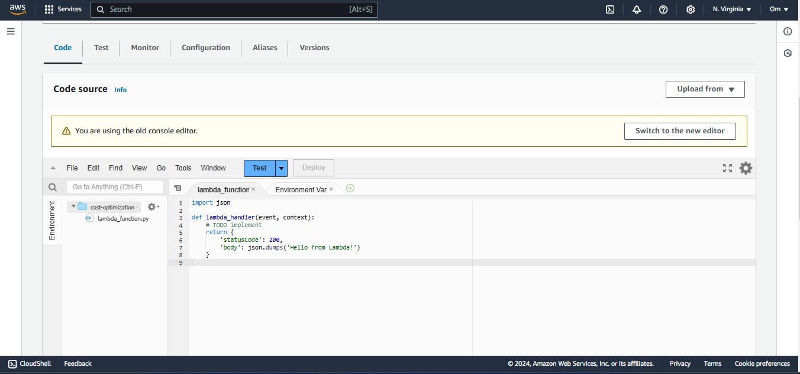

# AWS Cloud Cost Optimization - Identifying Stale EBS Snapshots

## Project Description
This project is aimed at helping AWS users optimize their storage costs by automatically identifying and deleting stale EBS snapshots. A stale EBS snapshot is one that is no longer associated with any active EC2 instance or is linked to a volume that does not exist. By cleaning up these unused snapshots, you can reduce unnecessary storage costs.

## Problem :
Sometimes, developers create EC2 instances with volumes attached to them by default. For backup purposes, these developers also create snapshots. However, when they no longer need the EC2 instance and decide to terminate it, they sometimes forget to delete the snapshots created for backup. As a result, they continue to incur costs for these unused snapshots, even though they are not actively using them.

## Solution :
We're using AWS to save money on storage costs. We made a Smart Lambda function that looks at our snapshots and our EC2 instances. If Lambda finds a snapshot that isn't connected to any active EC2 instances, it deletes it to save us money. This helps us keep our AWS costs down.

## Note :
There are many similar problems like this. For instance, we might attach an Elastic IP to our EC2 instance but forget to delete the Elastic IP after terminating the EC2 instance. In such a case, the Elastic IP continues to incur costs for us.

## Steps :
### Step 1:
1. Go into your AWS Console. 
2. Navigate to the EC2 Console. 
3. In the Instances section, select 'Instances,' and then click on 'Launch Instance'. 

4. Next, navigate to the 'Elastic Block Store' section and select 'Volumes'. 

5. You will notice that a default volume has already been created for us. 
6. Next, click on 'Snapshots,' and then click the 'Create Snapshot' button. It will prompt you with a page that looks like this. 

7. In Volume ID section choose your default Volume ID created when we create instance. 
8. Next, click 'Next,' provide a name for your Snapshot, and then scroll down and click 'Create Snapshot'. 

### Step 2 :
1. After creating a Snapshot, navigate to the Lambda Console.. 
2. You will see some options in the user interface, such as 'Create Function'. 
3. Click on 'Functions'. 

4. Select 'Author from Scratch,' then enter the Function name, and choose the latest Python version. 
5. Scroll down and click 'Create Function'. 
6.After creating the function, scroll down, and you will see something like the image below.. 

7. Click on the 'Code' section. 
8. Next, clear the existing code and replace it with the 'identify_stale_snapshots.py' code. 

9. Click 'Deploy' to save your changes, and then click 'Test.' It will prompt a page that looks like the one given below. 

10. Please configure the settings as displayed above and then scroll down. Next, click on 'Create Event'.  This will create us configuration of test events.
11. Once you've created the event, proceed to the IAM Console(Identity and Access Management) and then navigate policies section to create a new policy.

12. Select the service as 'EC2'

 

13. In the 'Actions' section, grant permissions for the following actions: DescribeInstances, DescribeVolumes, DescribeSnapshots, DeleteSnapshots.
14. After Creating the Policies , Navigate to the Lambda Sections.
15. Next, go to the page of the Lambda function you've created. In the "Permissions" section, click on the role name.

 

16. Click on 'Add Permissions' and then select 'Attach Policy.'

[2](screenshot/11.png) 

17. Choose the correct policy you have created earlier.

[2](screenshot/12.png) 

18. Then scroll down and click 'Add Permissions'.
19. After that, you can go to the Lambda function page and run the code; it will display some outputs as shown below. As our lambda function has not found any stale resources (snapshots), which are not in use or aren’t connected to any active EC2 instances.

[2](screenshot/13.png) 

### Step 3 :
1. You can terminate the EC2 instance to test our Lambda function.
2. Go to the EC2 console and then terminate the EC2 instance.
3. Return to the Lambda console to test the code; go to the Lambda Function page.
4. Under the Code section, click 'Test code', it will display an output like this.

[2](screenshot/14.png) 

5. As expected, our Lambda function deleted the snapshot because that is no longer associated with any active EC2 instance or is linked to a volume that does not exist.

## Additional:

We can use CloudWatch to automatically trigger the Lambda function every hour, day, minute, or second. However, this may result in higher costs because our Lambda execution time increases when triggered automatically. Nevertheless, manually triggering this function is a better choice because it allows us to trigger it when needed.

## CloudWatch or EventBridge Implementation :
### Steps :
1. Go to CloudWatch Console.

[2](screenshot/15.png) 
[2](screenshot/16.png) 
[2](screenshot/17.png) 
[2](screenshot/18.png) 

2. Next, on the following page, configure the schedule pattern as follows:

[2](screenshot/19.png) 

3. Scroll Down and then Click Next.
   
[2](screenshot/20.png) 

[2](screenshot/21.png) 

4. Specify the target as Lambda and select the correct lambda function we have created . Scroll Down and then Click Next.
5. On the next page, choose 'None' for the 'Action after Schedule' option.

[2](screenshot/22.png) 

[2](screenshot/23.png) 

[2](screenshot/24.png) 

6. You have successfully created the scheduler, which will trigger the Lambda function every hour.

[2](screenshot/25.png)

8. However, please note that this setup will incur some costs since the function is triggered continuously every hour. Alternatively, we can configure it to run on specific days and times as needed.

Done !!!!!!!!!!!!!

With this setup, we’ve successfully implemented an automated solution to identify and delete stale snapshots, helping to keep our AWS storage costs under control. This approach not only streamlines resource management but also ensures we’re paying only for the storage we truly need.
